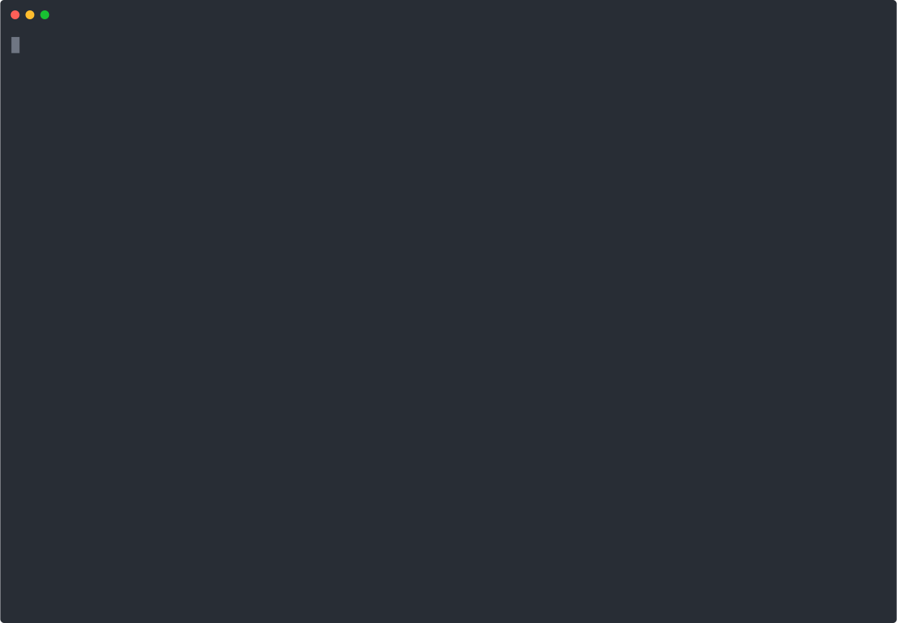

# Suwannee

<p align="center">
  
</p>

suwannee is a RESTful API to be used for blockchain connectivity. It has been tested and used to integrate with
Hyperledger Fabric peers directly, as well as Blockchain-as-a-Service (BaaS) providers. Longer term plan is to 
facilitate integration with multiple Distributed Ledger (DLT) solutions, such as R3 Corda (coming soon).

The goal of the framework is to enable direct smart contract calls from any programming language and/or platform. 
The obvious solution to the problem was to make it possible through RESTful calls.

Here is an example of how to call suwannee APIs from client applications:

```javascript
var request = require("request");

var options = { 
  method: 'GET',
  url: 'http://localhost:3001/api/blockchain',
  qs: 
   { applicationId: 'marbles',
     applicationContext: 'defaultChannel',
     identity: 'bcUser',
     functionName: 'getAll' },
  headers: 
   { 
     Authorization: 'Bearer eyJ0e...fojdRM'
   } 
  };

request(options, function (error, response, body) {
  if (error) throw new Error(error);

  console.log(body);
});
```

The above request invokes `getAll` method of `marbles` smart contract (chaincode) that is deployed on channel
`defaultChannel`. In this case the HTTP method used is GET, since it is a query, however, POST method is also 
available.

```javascript
var options = { 
  method: 'POST',
  url: '...',
  headers: 
   { ... },
  body: 
   { applicationId: 'marbles',
     applicationContext: 'defaultChannel',
     identity: 'bcUser',
     functionName: 'move',
     functionArguments: [ 'a', 'b', '10' ] 
   },
};
```

Above example is for a chaincode "Invoke". Since it's an update, Http method=POST. This example also shows how to pass arguments to the smart contract.

## Build Status

At this point, the framework is capable of starting a REST service and connect to a Hyperledger Fabric peer or
a GRPC service provided by a Blockchain-as-a-Service solution.

One can perform effortlessly a chaincode "Invoke" or a "Query" without worrying about the back end.

### Prerequisites

The prerequisites are:

```
Node v8.15.0
yarn
```

### Building executables with the source code

A step by step series of examples that tell you how to get a development env running

Download and Install

```
git clone repo_url
cd suwannee
yarn
yarn build
yarn test
yarn test:e2e ❗️
yarn link
(optional)chmod +x /usr/local/bin/suwannee
```

## Running tests and eslint

Running tests will generate coverage report , which you can find under `coverage` directory . Open `coverage/index.html` in your browser to see the report

### All Tests

Based on integration networks you have access to you can run following commands
`yarn test`

### Tslint

`yarn lint`

#### Documentation

`yarn docs`

Run above command to generate documentation. You can find documentation under `docs`directory. Open `docs/index.html`in you browser to see documentation.

## Usage

`$ npm install --save suwannee`
or
`$ yarn add suwannee`

## To start the Rest API

```
$ suwannee  start -c <path_to_config_file>
```

## JWT Authentication

#### Key generation

Replace clientId with consumer id

```
$ ssh-keygen -t rsa -b 4096 -m PEM -f clientId.key -P ""
$ openssl rsa -in clientId.key -pubout -outform PEM -out clientId.key.pub
$ openssl base64 -in clientId.key.pub -out clientId.encoded.key.pub
```

#### Key File structure

```
[
  {
    "clientId": "consumer id",
    "key": "content of clientId.encoded.key.pub"
  }
]
```

#### Token structure

```
HEADER:ALGORITHM & TOKEN TYPE

{
  "alg": "ES256",
  "typ": "JWT"
}

PAYLOAD:Name of client & The time the JWT was issued

{
"clientId" : "nameofclient",
"iat" : 1516239022
}

SIGNATURE : Generated while signing
{
  xyz
}
```

#### Token generation

```
$ npm install -g jwtgen
$ jwtgen -a RS256 -p /path/to/clientId.key -c "clientId=consumerid"
```

#### Authorization Header format

Authorization : Bearer < jwtToken >

## Application configuration 

[Here](./example.config.json) is the structure of the config file.

## ❗️Note on e2e testing

To run end to end tests you would require connection_profile.json and creds in the folders '.config' and '.wallet' respectively which are need to be created under suwannee/.

## Known limitations

* Framework handles a single provider: Fabric
* Currently, deployment is supported for a single channel/chaincode

## Authors

* Tajamul Fazili <tajamul.fazili@aexp.com> [TajamuFazili](https://github.com/tajamulfazili)
* Chandrakanth Mamillapalli [chandrakanthm](https://github.com/chandrakanthm)
* Andras L Ferenczi <andras.l.ferenczi@aexp.com> [andrasfe](https://github.com/andrasfe)


## Contributing

We welcome Your interest in the American Express Open Source Community on Github. Any Contributor to any Open Source
Project managed by the American Express Open Source Community must accept and sign an Agreement indicating agreement to
the terms below. Except for the rights granted in this Agreement to American Express and to recipients of software
distributed by American Express, You reserve all right, title, and interest, if any, in and to Your Contributions.
Please [fill out the Agreement](https://cla-assistant.io/americanexpress/suwannee).

Please feel free to open pull requests and see `CONTRIBUTING.md` for commit formatting details.

## License

Any contributions made under this project will be governed by the [Apache License 2.0](LICENSE).

## Code of Conduct

This project adheres to the [American Express Community Guidelines](CODE_OF_CONDUCT.md). By participating, you are
expected to honor these guidelines.
